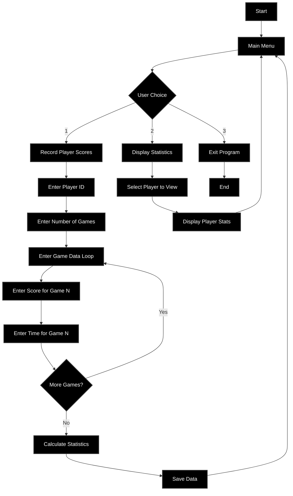

# Fixed Player Statistics System Flowchart

This flowchart has been recreated with proper visibility - all boxes now have black backgrounds with white text.

## Mermaid Flowchart

## HTML Version (Alternative)

The HTML version has been created as `fixed_flowchart.html` with the following improvements:

- **All boxes**: Black background (#000000) with white text (#ffffff)
- **Decision diamonds**: Black background with white text
- **Clear arrows**: Visible connection lines between elements
- **Proper spacing**: Better layout for readability
- **Loop indication**: Clear visual representation of the game data entry loop

## Key Fixes Applied

1. **Visibility Issue Resolved**: All previously white/invisible text boxes now have black backgrounds with white text
2. **Consistent Styling**: Uniform appearance across all flowchart elements
3. **Clear Flow**: Easy to follow program logic from start to end
4. **Loop Representation**: Game data entry loop is clearly marked and contained

## Flowchart Structure

The flowchart represents a Player Statistics System with three main branches:

1. **Record Player Scores** (Option 1):
   - Enter Player ID
   - Enter Number of Games
   - Loop through game data entry (score and time for each game)
   - Calculate statistics
   - Save data
   - Return to main menu

2. **Display Statistics** (Option 2):
   - Select player to view
   - Display player statistics
   - Return to main menu

3. **Exit Program** (Option 3):
   - End the program

All text is now clearly readable with proper contrast between background and text colors.